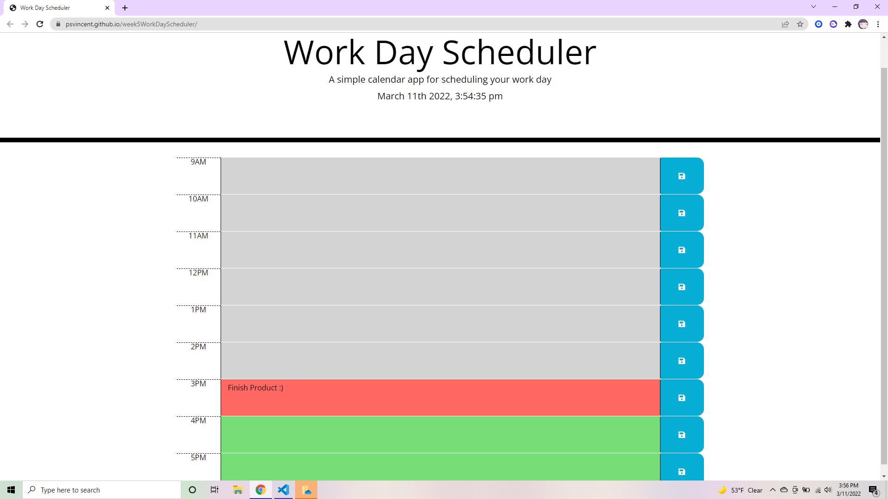

# Work Day Scheduler
## Description
This is a work day scheduler that allows you to keep track of your day by the hour.  It is color coded so the hours that are already in the past are gray, the current hour is red, and the future hours are green.  It also has a clock at the top that shows you the current time.
### Linked Deployed Application
https://psvincent.github.io/work-day-scheduler/
### Screenshot of Live Application

